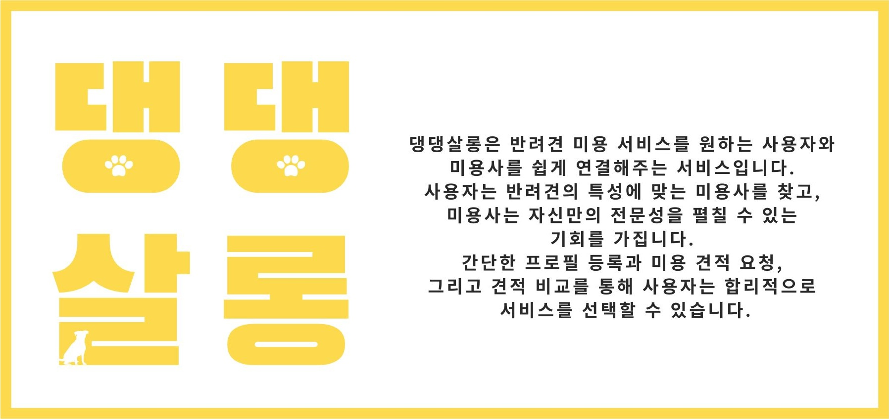

# 댕댕살롱 Dang Dang Salon

**Server Repo**: [DangDang Salon Server](https://github.com/Ureca-Dangdang-salon/dang_server)



## 주요 기능

- 소셜 로그인
- 반려견 및 미용사 프로필 관리
- 애견 미용 콘테스트
- 견적 요청, 수락, 거절, 수정
- 채팅
- 쿠폰 이벤트
- PG 결제 & 쿠폰 적용
- 리뷰 작성, 수정, 삭제
- 우리아이시뮬레이션 AI 이미지 생성

## 🔨 Tech Stack

- **Frontend**: Vite, React.js
- **State Management**: Zustand
- **UI**: Material UI, Storybook
- **Deployment**: Vercel

## 🖥️ Project Setup

### **Prerequisites**

- **Node.js**
- **npm** (or **yarn**)

### **Installation**

1. **Clone the Repository**

   ```bash
   git clone https://github.com/URECA-TEAM3/moongchee-client.git
   cd dang_client
   ```

2. Install Dependencies
   ```bash
   npm install (or npm i)
   ```
3. Set Up Environment Variables

   Please contact one of our members to obtain the variables

4. Start the Server
   ```bash
   npm run dev
   ```
   The server should now be running at http://localhost:5173
